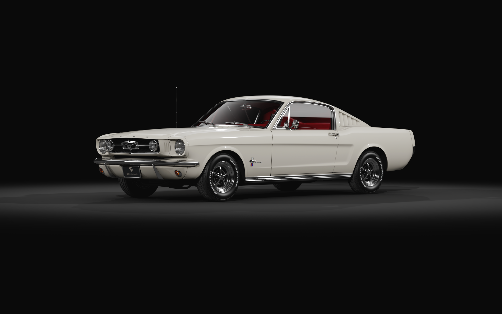
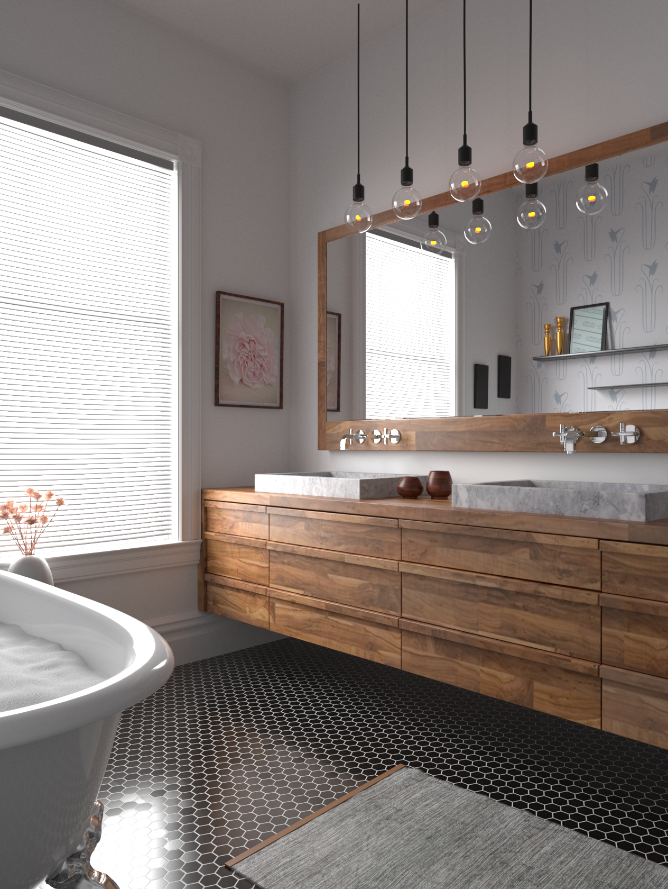
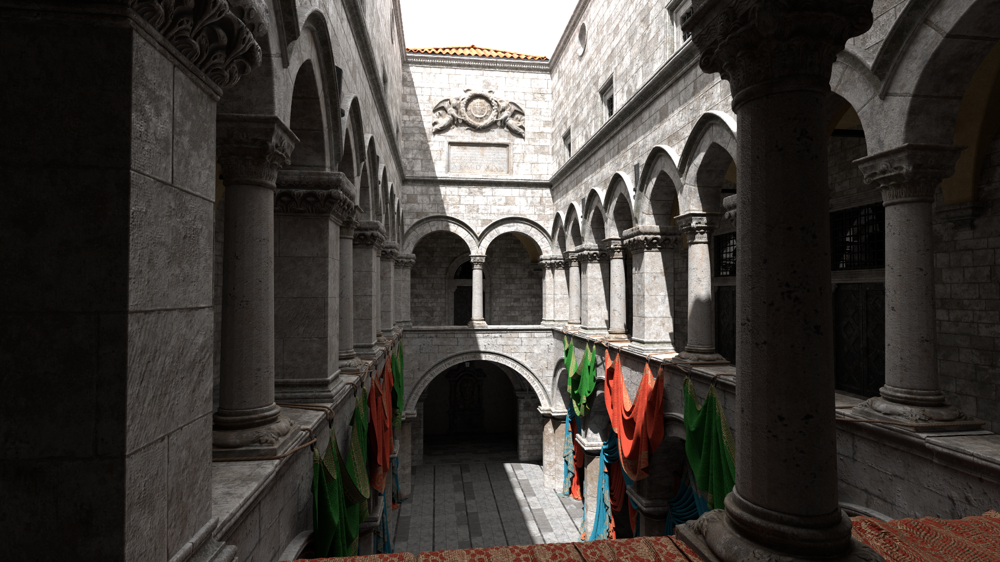
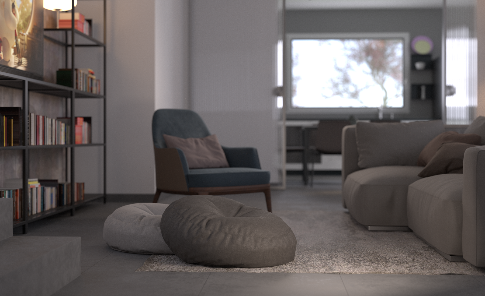
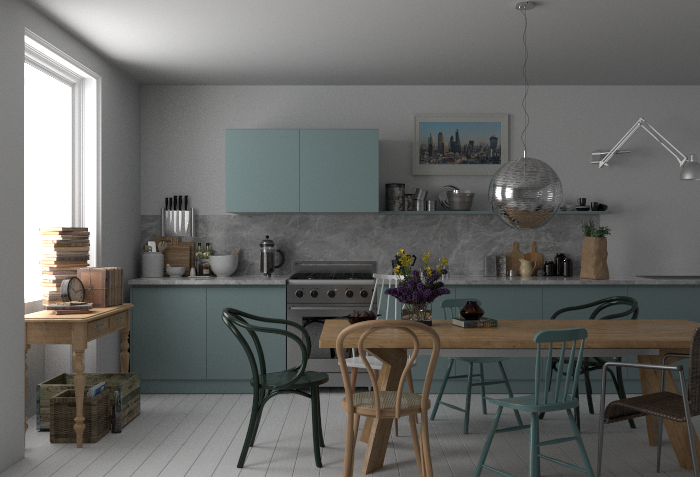
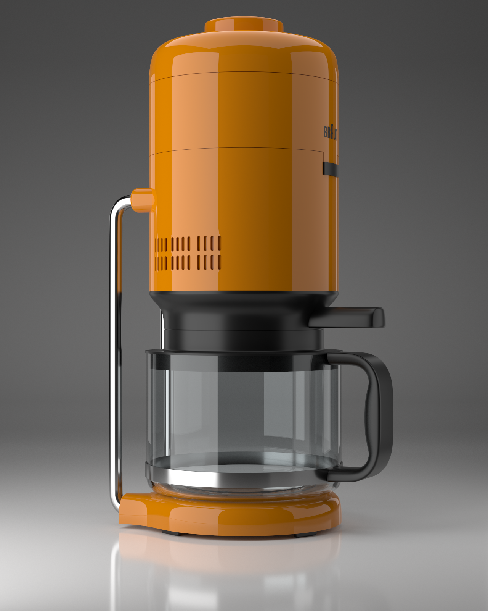
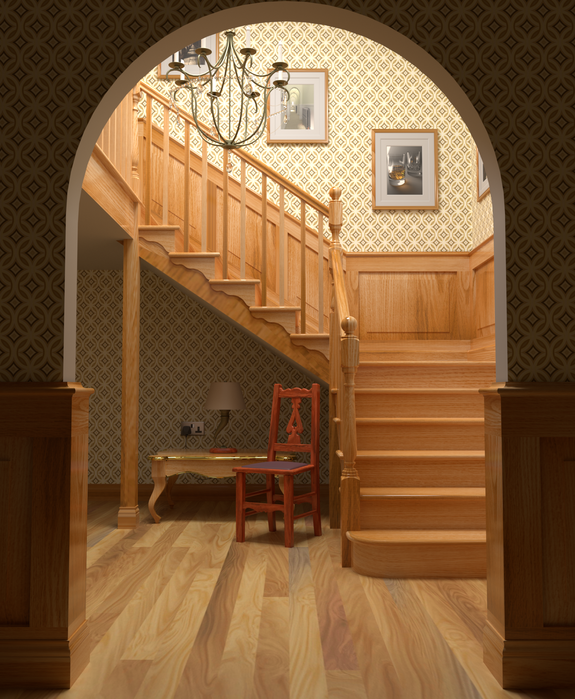

Test application for a Ray library bundled with many test scenes. Mostly needed for CI checks.
  - Library part can be found here: https://github.com/sergcpp/Ray

  
Images

  - Links to the original test scenes:  \
    https://benedikt-bitterli.me/resources/  \
    https://www.blender.org/download/demo-files/  \
    https://www.intel.com/content/www/us/en/developer/topic-technology/graphics-research/samples.html  \
    https://developer.nvidia.com/orca/amazon-lumberyard-bistro \
    https://wirewheelsclub.com/models/1965-ford-mustang-fastback \
    https://evermotion.org/shop/show_product/scene-1-ai43-archinteriors-for-blender/14564

  
  

  
  

  
  

  
  

